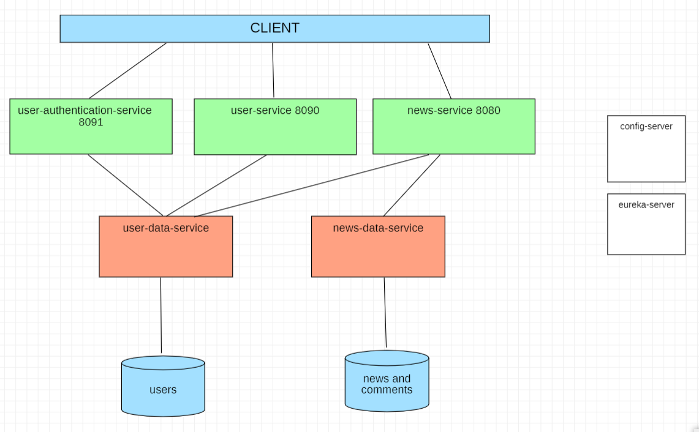

### The final task in the courses at the Clevertec company.

#### RESTful web service that implements functionality for working with news.

###### Author: Nikita Semeniuk.

#### Description:

##### The idea of the application is the ability to manage the news service through the REST interface. The application implements the possibility of getting a list of news, getting one news with comments to it, creating, updating, deleting news, as well as similar operations with comments and registered users.

##### The application is built on a microservice architecture and contains five microservices.

##### There are two non-public microservices (user-data-service and news-data-service), each of which works with a separate database.

##### The public microservices are the user-authentication-service, the user-service, and the news-service.

##### The main purpose of the user-service is user registration in the system.

##### The user-authentication-service is designed to receive a JWT token for users registered in the system.

##### News-service allows you to perform operations on news and comments.

##### Unregistered users can view news and comments without restrictions. Other operations are not available to them. A registered user, within the limits of his powers, can carry out various operations related to changes in news, comments and users themselves. The description of the powers of the various users are defined in the task.

#### Stack:

Java, Spring Boot, PostgresSQL, Liquibase, Redis, Docker

#### How to run:

1. Run docker-compose -f docker-compose.yml up --build -d
2. Send a request to any available endpoint (see
   documentation http://localhost:8090/swagger-ui/index.html, http://localhost:8080/swagger-ui/index.html, http://localhost:8091/swagger-ui/index.html)
   in accordance with the user's permissions (the distribution of permissions is specified in the task).

#### Ports exposed:

8080 - news-service
8090 - user-service
8091 - user-authentication-service

#### Registration procedure in the system:

1. To register in the system: POST http://localhost:8090/v1/users (Request body: firstName, lastName, email, password)
   By default, registration in the system is carried out with the role of SUBSCRIBER. A user with ADMIN authority can
   change the role for a user.
2. Get a JWT token from the authentication server: POST http://localhost:8091/v1/security/login (Request body: email,
   password)
3. Use the possibilities of the service in accordance with the powers of the SUBSCRIBER

#### Credentials of registered users:

1. ADMIN - email: admin@admin.ru, password: password
2. JOURNALIST - email: journalist@journalist.ru, password: password
3. SUBSCRIBER - email: subscriber@subscriber.ru, password: password

